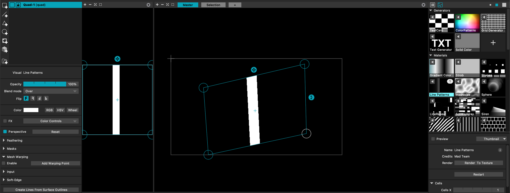

# Utiliser MadMapper rapidement

Le but est de mettre en place rapidement un mapping en utilisant Madmapper. Madmapper permet de caler des visuels sur des objets réels en 3D avec de la projection vidéo (notamment des visuels déjà présents dans le logiciel, dont on peux modifier différents paramètres), et enchaîner entre différents visuels.

## L'interface

L'interface de MadMapper se présente en trois partie : la partie de gauche nous permet de créer de nouvelles surfaces et de gérer les projecteurs, la partie du milieu affiche à la fois la texture, l'interface de projection et le tableau des scènes, tandis que la partie de droite référence nos textures.

### Créer une surface

Les 5 onglets de la partie de droite permettent de configurer : les surfaces, les lumières en DMX, les projecteurs, les modules, et les Masters. 

Nous allons principalement nous intéresser au première onglet : en cliquant sur l'icône `Add a Video Quad`, on créée une surface carré sur l'interface de projection, que l'on peux redimensionner, pivoter, et dont on peux déplacer les coins.

### Appliquer une texture

On applique une texture sur une surface en sélectionnant cette surface, puis en cliquant sur la flèche de la texture désirée dans la partie gauche de l'interface.

La texture s'affiche alors dans la partie du milieu, à la fois sur la surface dans l'interface de projection, mais aussi dans la partie texture où on peux venir la redimensionner ou la pivoter.

Lorsqu'une texture est sélectionné, on peux modifier différents paramètres dans la partie de droite en dessous de la liste des textures : l'échelle, la couleur, la vitesse d'animation, etc.

### Créer une scène

Pour créer une scène, il suffit de cliquer sur un + dans une case vide du tableau des scènes.

Ensuite, même si on modifie les textures ou la position des surfaces, cliquer à nouveau sur la flèche de lecture de la scène repositionnera toute la projection comme dans la scène sélectionné.

On peux mettre à jour une scène en faisait clic droit > `Update Scene`, et créer autant de scène que nécessaire. 

### Créer une cue# Madmapper_2spi
