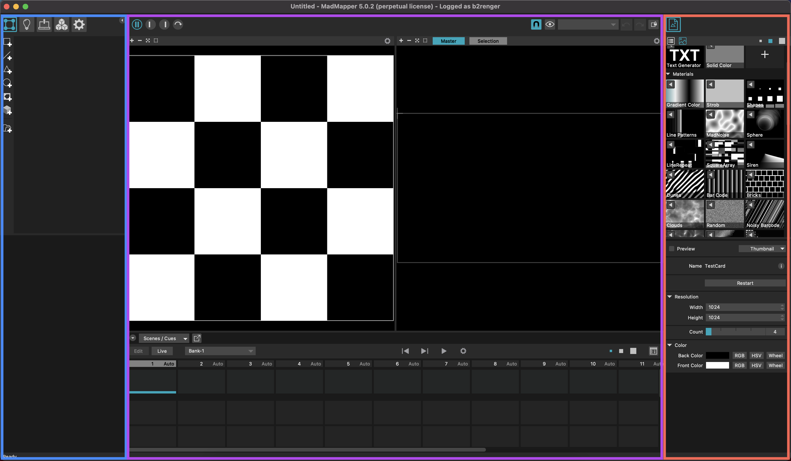
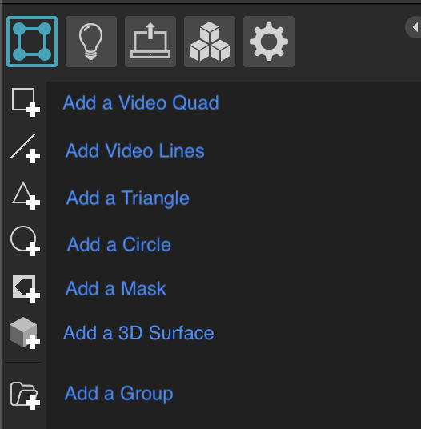
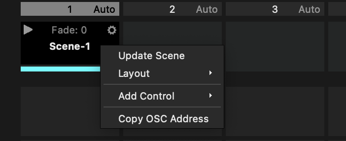
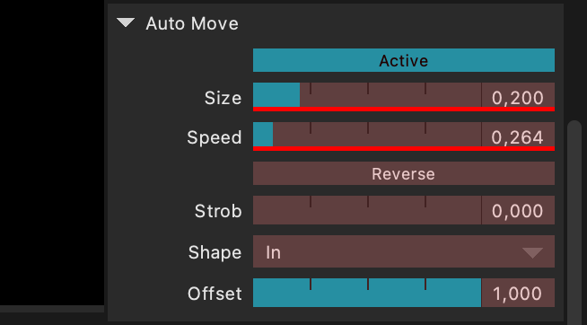
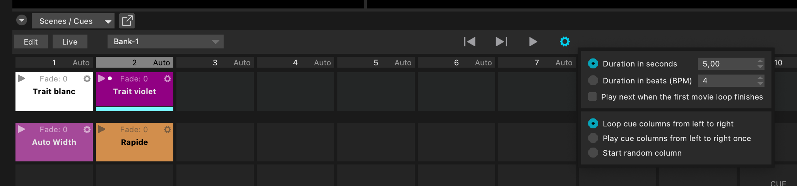
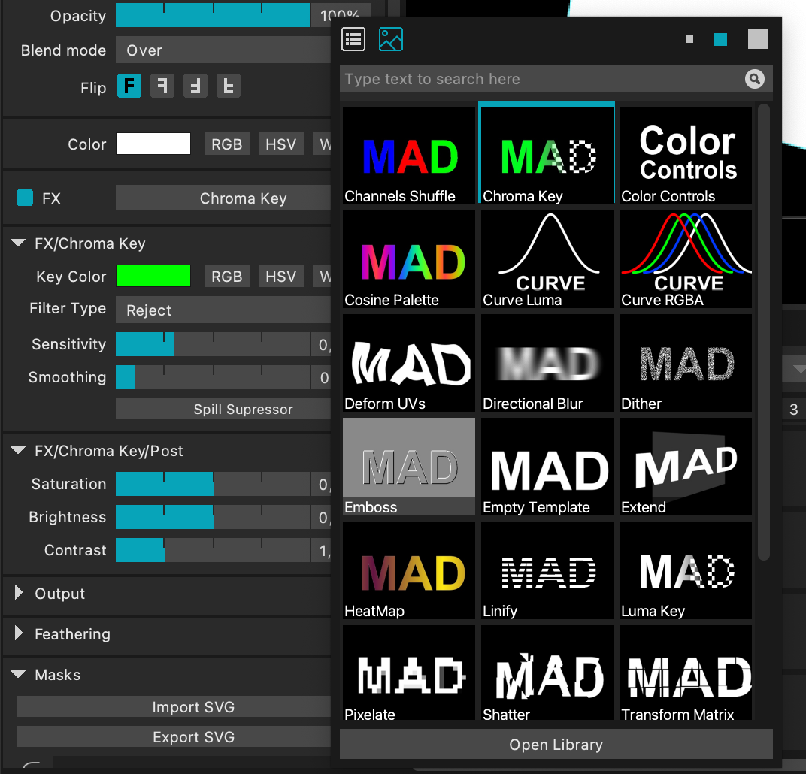
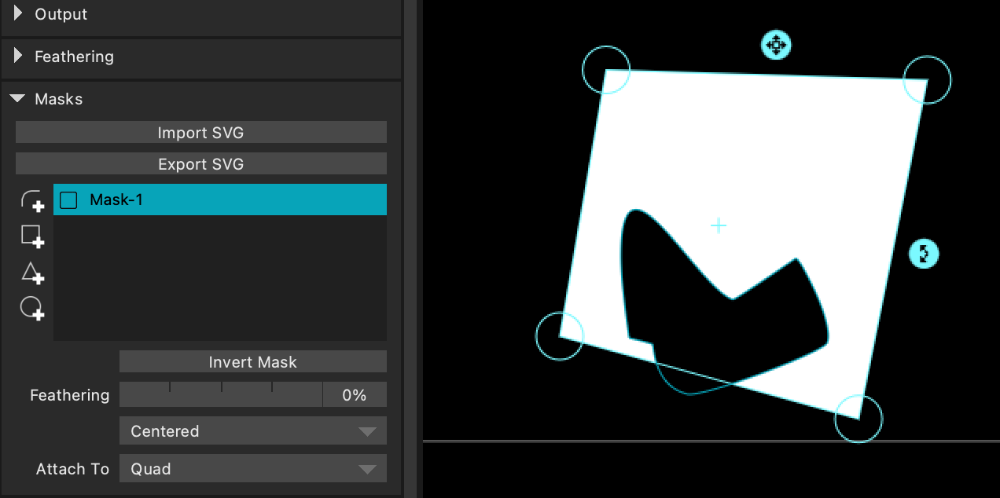

# Utiliser MadMapper rapidement

Le but est de mettre en place rapidement un mapping en utilisant Madmapper. Madmapper permet de caler des visuels sur des objets réels en 3D avec de la projection vidéo (notamment des visuels déjà présents dans le logiciel, dont on peux modifier différents paramètres), et enchaîner entre différents visuels.

## L'interface

L'interface de MadMapper se présente en trois partie : la partie de gauche nous permet de créer de nouvelles surfaces et de gérer les projecteurs, la partie du milieu affiche à la fois la texture, l'interface de projection et le tableau des scènes, tandis que la partie de droite référence nos textures.

Les 5 onglets de la partie de droite permettent de configurer : les surfaces, les lumières en DMX, les projecteurs, les modules, et les Masters.

## Projection

**Attention :** Pour que l'interface de projection soit à l'échelle par rapport à la résolution du vidéo projecteur, il faut aller dans le troisième onglet, `Manage Outputs`, et entrer la résolution indiquée sous le nom du vidéo projecteur dans la case `Output Size`.

Ensuite, il faut s'assurer que la destination sélectionnée est bien le projecteur et non l'écran de l'ordinateur, et que les moniteurs ne sont pas en mode "recopie vidéo" mais bien en "étendue d'écran".

On peux ensuite cliquer sur `Desktop Window` afin d'ouvrir une fenêtre de projection, et la faire glisser sur l'écran étendu qui est projeté par le projecteur.

Il faut ensuite cocher l'option `Full Screen Mode` dans l'onglet Output de la barre de menu, et on peux cocher l'option `Video Cursor` pour afficher des repères blancs qui suivent la souris.

## Surfaces et textures

### Créer une surface

Nous allons principalement nous intéresser au première onglet : en cliquant sur l'icône `Add a Video Quad`, on créée une surface carré sur l'interface de projection, que l'on peux redimensionner, pivoter, et dont on peux déplacer les coins.

### Appliquer une texture

On applique une texture sur une surface en sélectionnant cette surface, puis en cliquant sur la flèche ◀️ de la texture désirée dans la partie gauche de l'interface.

La texture s'affiche alors dans la partie du milieu, à la fois sur la surface dans l'interface de projection, mais aussi dans la partie texture où on peux venir la redimensionner ou la pivoter.

Lorsqu'une texture est sélectionné, on peux modifier différents paramètres dans la partie de droite en dessous de la liste des textures : l'échelle, la couleur, la vitesse d'animation, etc.

## Les scènes et les cues

Les scènes et les cues permettent d'enregistrer des paramètres des surfaces et des textures afin de pouvoir les animer et les jouer à la suite. On peux par exemple enchaîner plusieurs vidéos sur une surface, ou alterner entre différentes animations.

### Créer une scène

Pour créer une scène, il suffit de cliquer sur le ➕ dans une case vide du tableau des scènes.

Ensuite, même si on modifie les textures ou la position des surfaces, cliquer à nouveau sur la flèche de lecture de la scène repositionnera toute la projection comme dans la scène sélectionné.

On peux mettre à jour une scène en faisait clic droit > `Update Scene`, et créer autant de scène que nécessaire. 

### Créer une cue

À la différence d'une scène qui retient tous les paramètres mis en place, une cue ne sauvegarde qu'un ou plusieurs paramètres sélectionnés, et permet de l'appliquer à différentes scènes.

Pour créer une cue, il faut activer le mode `Edit` dans le tableau des scènes, et modifier un des paramètres en cliquant avec la touche Maj ou ajouter le paramètre avec sa valeur actuelle en cliquant dessus.

Lorsque le mode `Edit` est activé, tous les paramètres modifiables sont surlignés en rouge, et ceux qui ont été modifiés et sont sauvegardés dans la cue sont soulignés en route.

On peux également modifier des paramètres et faire clic droit > `Update values` pour mettre à jour les valeurs de la cue.

### Interface des scènes et cues

Il est possible de modifier le nom des scènes ou des cues en double cliquant dessus, et de modifier la couleur des cases en cliquant sur l'engrenage ⚙️ afin de visualiser rapidement ce qui correspond à quoi.

### Programmer les scènes et les cues

Dans le même menu engrenage ⚙️, on peux choisir le temps et le mode de fondu de chaque scène et cue, afin que le fondu entre chaque paramètre soit plus ou moins long lorsqu'on les enchaîne.

De la même façon, on peux modifier la durée par défaut de chaque colonne(donc de chaque scène) dans l'engrenage ⚙️ principal du tableau des scènes, en lui donnant une valeur en secondes ou en BPM, ou choisir que l'on enchaîne les colonnes à chaque fin de vidéo présent dans les textures.

On peux également choisir que les colonnes s'enchaînent de gauche à droite une fois, en boucle, ou de manière aléatoire.

Il suffit ensuite de cliquer sur la flèche de lecture ▶️ pour lancer la séquence.

# **Bonus** : utiliser de l'OSC dans MadMapper

### Avec juste ZIG SIM

Pour contrôler différents paramètres de MadMapper avec OSC depuis son téléphone par exemple, il faut au préalable installer une application d'envoi d'OSC tel que ZIG SIM, et connecter le téléphone et l'ordinateur au même réseau wifi. Il est possible de récuperer directement depuis ZIG SIM, même si ce n'est pas idéal.

Dans le menu `Preferences` de MadMapper, ajuster le numéro de port et l'adresse IP pour être la même que celle du réseau Wifi et du téléphone sur ZIG SIM.

Dans ZIG SIM, le format de message doit donc être en OSC, et c'est mieux si le nom du téléphone (DEVICE UUID) est un truc simple en un seul mot.

Ensuite, dans MadMapper, pour contrôler par exemple la valeur de la rotation de notre texture vidéo avec le téléphone, on clic-droit sur le slider rotation > `Add Control` > `OSC`.

On arrive ainsi dans la fenêtre Control List, dans l'onglet OSC, avec la liste de contrôle (qui ne contient ici que celui qu'on vient de créer).

Pour récupérer par exemple la première donnée, x, de l'accéléromètre du téléphone, on sélectionne "/lucie/accel/#1" (ici "lucie" le nom du téléphone).
En cliquant sur `Learn` en déplaçant le téléphone pour obtenir des valeurs, on obtient la plage de valeurs que cette donnée prend, qui est ensuite mise à l'échelle sur la plage de valeur de la rotation de la texture.

//

### En passant par Processing
