# Utiliser MadMapper rapidement

**Ou comment mettre en place rapidement un mapping en utilisant Madmapper.
Madmapper permet de caler des visuels sur des objets réels en 3D avec de la projection vidéo (notamment des visuels déjà présents dans le logiciel, dont on peux modifier différents paramètres), et enchaîner entre différents visuels.**

Pour aller + loin, il y a le tuto [utilisation du Spatial Scanner](https://github.com/LucieMrc/MadMapper-SpatialScanner-Tuto) pour scanner rapidement des scènes et en sortir une image correspondant à ce que "voit" le projecteur.

## Sommaire

* [L'interface](#linterface) 
* [Projection](#projection) 
* [Surfaces et textures](#Surfaces-et-textures) 
    * [Créer une surface](#Créer-une-surface) 
    * [Appliquer une texture](#Appliquer-une-texture) 
* [Les scènes et les cues](#Les-scènes-et-les-cues) 
    * [Créer une scène](#Créer-une-scène) 
    * [Créer une cue](#Créer-une-cue) 
    * [Interface des scènes et cues](#Interface-des-scènes-et-cues) 
    * [Programer les scènes et les cues](#Programmer-les-scènes-et-les-cues) 
* [Pour aller + loin](#pour-aller--loin) 

## L'interface

L'interface de MadMapper se présente en trois partie : la partie de gauche nous permet de créer de nouvelles surfaces et de gérer les projecteurs, la partie du milieu affiche à la fois la texture, l'interface de projection et le tableau des scènes, tandis que la partie de droite référence nos textures.

Les 5 onglets de la partie de droite permettent de configurer : les surfaces, les lumières en DMX, les projecteurs et écrans, les modules, et les Masters.

## Projection

**Attention :** Pour que l'interface de projection soit à l'échelle par rapport à la résolution du vidéo projecteur, il faut aller dans le troisième onglet, `Manage Outputs`, et entrer la résolution indiquée sous le nom du vidéo projecteur dans la case `Output Size`.

Ensuite, il faut s'assurer que la destination sélectionnée est bien le projecteur et non l'écran de l'ordinateur, et que les moniteurs ne sont pas en mode "recopie vidéo" mais bien en "étendue d'écran".

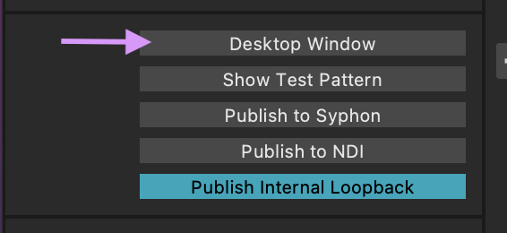

On peux ensuite cliquer sur `Desktop Window` afin d'ouvrir une fenêtre de projection, et la faire glisser sur l'écran étendu qui est projeté par le projecteur.

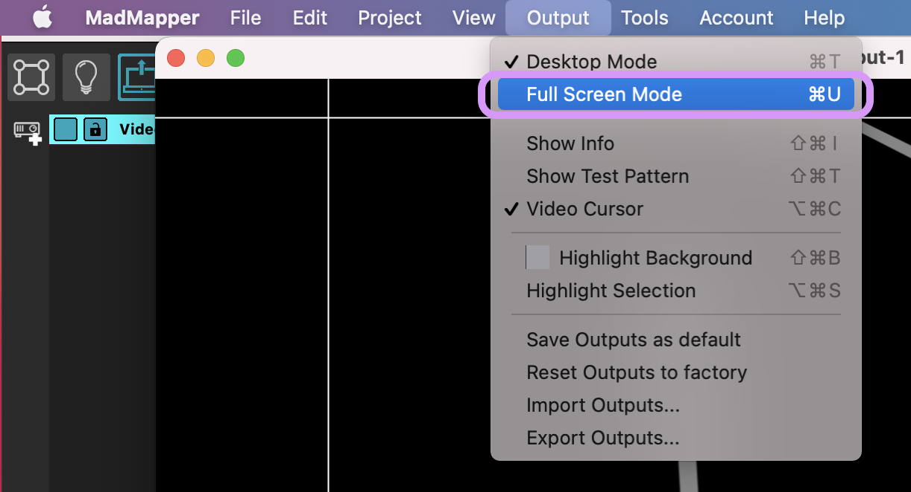

Il faut ensuite cocher l'option `Full Screen Mode` dans l'onglet Output de la barre de menu, et on peux cocher l'option `Video Cursor` pour afficher des repères blancs qui suivent la souris.

**Attention :** Pour quitter le mode full screen, faire ctrl+T.

## Surfaces et textures

### Créer une surface

Nous allons principalement nous intéresser au première onglet : en cliquant sur l'icône `Add a Video Quad`, on créée une surface carré sur l'interface de projection, que l'on peux redimensionner, pivoter, et dont on peux déplacer les coins.

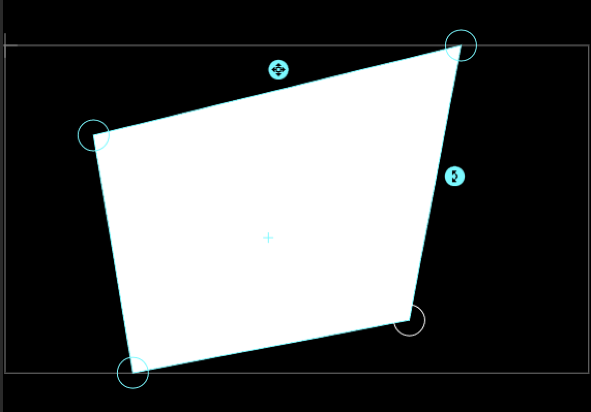

Dans les paramètres en dessous de la liste des surfaces, on peux choisir l'opacité et le mode de fusion de la surface.

Avec l'option `FX`, on peux choisir un effet visuel à appliquer sur la surface et sa texture, notamment l'effet Chroma Key pour enlever le fond vert d'une vidéo, ou l'effet Luma Key pour enlever un fond noir ou blanc.

On peux également flouter le contour de la surface avec l'option `Feathering`.

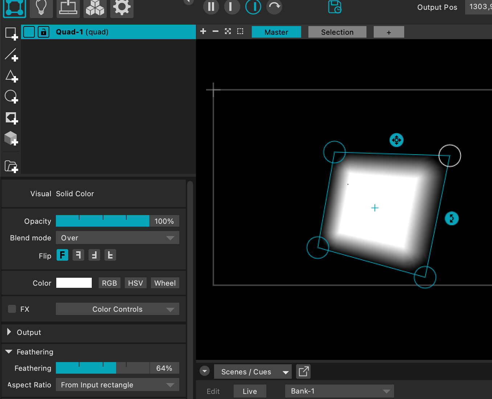

On peux créer un masque dans la surface avec l'option `Mask`. Le masque peux soit masquer une partie de la surface, ou bien masquer l'extérieur du masque si on choisit `Invert Mask`.

Enfin, on peux créer les contours d'une surface en cliquant sur l'option `Create Lines From Surface Outlines` tout en bas des paramètres.

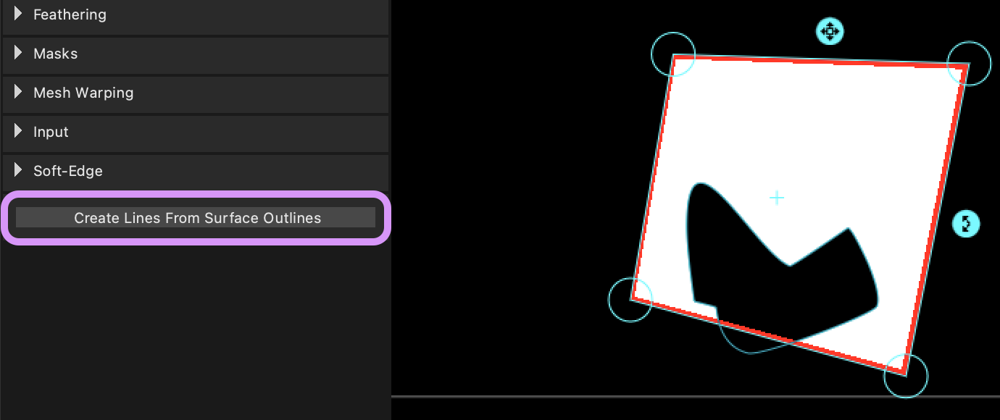

Cette option crée les contours comme une surface à part, avec ses propres paramètres (notamment la largeur des lignes) et à laquelle on peux appliquer sa propre texture.
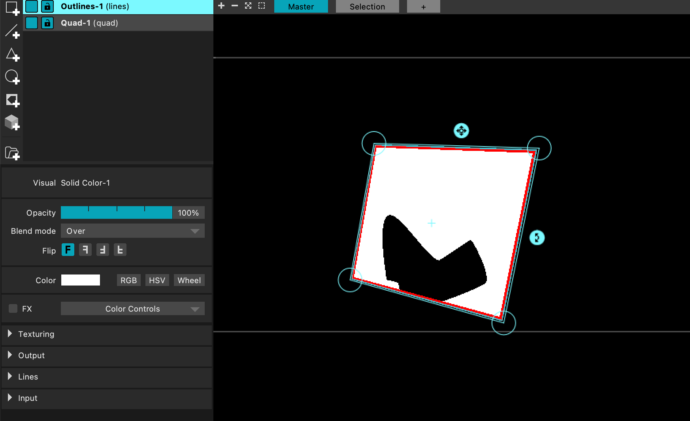

### Appliquer une texture

On applique une texture sur une surface en sélectionnant cette surface, puis en cliquant sur la flèche ◀️ de la texture désirée dans la partie gauche de l'interface.

La texture s'affiche alors dans la partie du milieu, à la fois sur la surface dans l'interface de projection, mais aussi dans la partie texture où on peux venir la redimensionner ou la pivoter.

Lorsqu'une texture est sélectionné, on peux modifier différents paramètres dans la partie de droite en dessous de la liste des textures : l'échelle, la couleur, la vitesse d'animation, etc.

On peux accéder à d'autres textures de Madmapper en cliquant sur le bouton ➕ de la liste des textures.
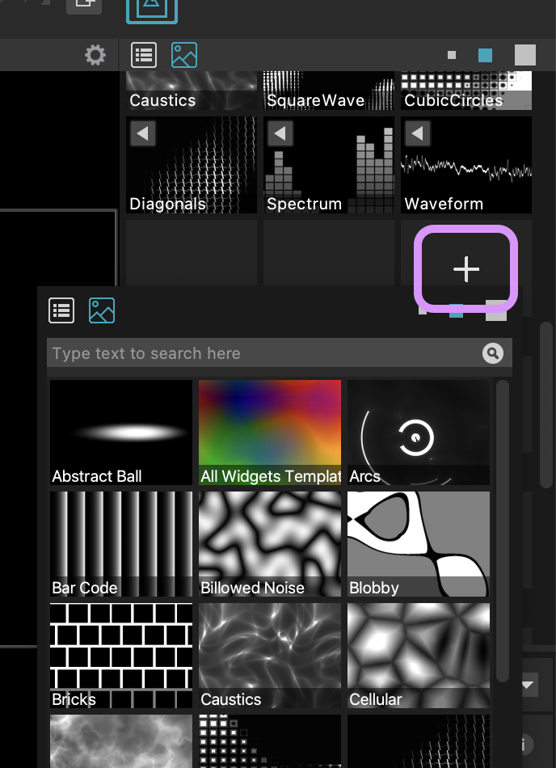

## Les scènes et les cues

Les scènes et les cues permettent d'enregistrer des paramètres des surfaces et des textures afin de pouvoir les animer et les jouer à la suite. On peux par exemple enchaîner plusieurs vidéos sur une surface, ou alterner entre différentes animations.

### Créer une scène

Pour créer une scène, il suffit de cliquer sur le ➕ dans une case vide du tableau des scènes.

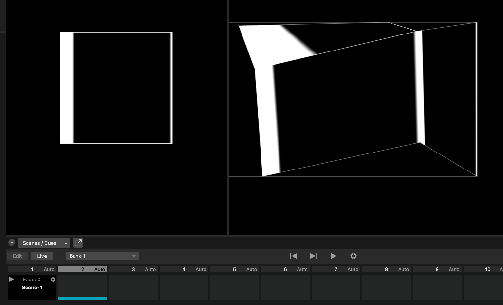

Ensuite, même si on modifie les textures ou la position des surfaces, cliquer à nouveau sur la flèche de lecture de la scène repositionnera toute la projection comme dans la scène sélectionné.

On peux mettre à jour une scène en faisait clic droit > `Update Scene`, et créer autant de scène que nécessaire. 

### Créer une cue

À la différence d'une scène qui retient tous les paramètres mis en place, une cue ne sauvegarde qu'un ou plusieurs paramètres sélectionnés, et permet de l'appliquer à différentes scènes.

Pour créer une cue, il faut activer le mode `Edit` dans le tableau des scènes, et modifier un des paramètres en cliquant avec la touche Maj ou ajouter le paramètre avec sa valeur actuelle en cliquant dessus.

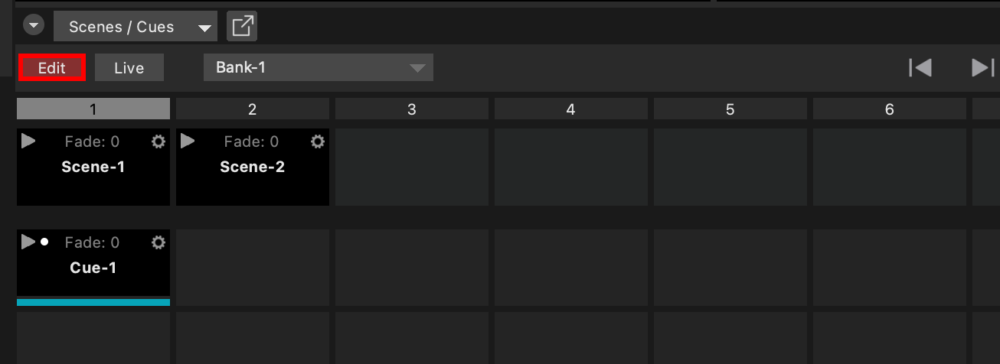

Lorsque le mode `Edit` est activé, tous les paramètres modifiables sont surlignés en rouge, et ceux qui ont été modifiés et sont sauvegardés dans la cue sont soulignés en route.

On peux également modifier des paramètres et faire clic droit > `Update values` pour mettre à jour les valeurs de la cue.

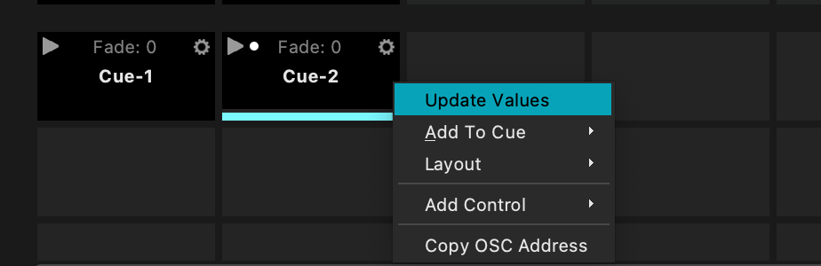

### Interface des scènes et cues

Il est possible de modifier le nom des scènes ou des cues en double cliquant dessus, et de modifier la couleur des cases en cliquant sur l'engrenage ⚙️ afin de visualiser rapidement ce qui correspond à quoi.

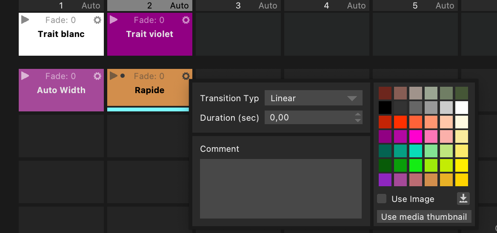

### Programmer les scènes et les cues

Dans le même menu engrenage ⚙️, on peux choisir le temps et le mode de fondu de chaque scène et cue, afin que le fondu entre chaque paramètre soit plus ou moins long lorsqu'on les enchaîne.

De la même façon, on peux modifier la durée par défaut de chaque colonne(donc de chaque scène) dans l'engrenage ⚙️ principal du tableau des scènes, en lui donnant une valeur en secondes ou en BPM, ou choisir que l'on enchaîne les colonnes à chaque fin de vidéo présent dans les textures.

On peux également choisir que les colonnes s'enchaînent de gauche à droite une fois, en boucle, ou de manière aléatoire.

Il suffit ensuite de cliquer sur la flèche de lecture ▶️ pour lancer la séquence.

## Créer un contrôle

### Lancer une scène avec le clavier

 
Faire un clic-droit sur la scène, puis faire Add Control > Keyboard.

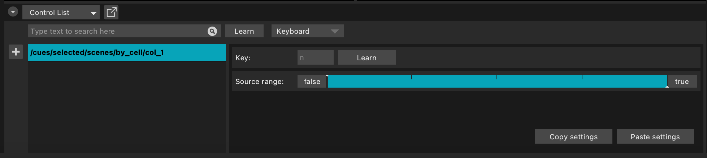

L'interface "Control List" s'ouvre, le contrôle est créé :
/cues/selected/scenes/by_cell/col_1 pour la scène selectionnée à la colonne 1.

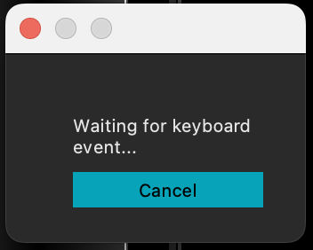

Pour choisir la touche du clavier associée, on clique sur le bouton `Learn`, ce qui ouvre la fenêtre "Waiting for keyboard event..." et on appuie sur la touche pour sélectionner la lettre.

En créant ce contrôle sur chacunes des scènes, on peux naviguer entre les scènes grâce aux claviers.

## Autres contrôles

On peux faire un clic droit > Add Control sur la plupart des élements de Madmapper, que ce soit une action/un bouton (démarrer une vidéo, activer le son, passer à la scène suivante, etc) ou un paramètre (l'opacité, la vitesse, le niveau du son).

On peux ainsi contrôler ces élements avec :
- le clavier
- des évenements MIDI
- des messages OSC
- de l'audio
- des évenements Madmapper :
    - le BPM
    - les évenements "Media Playback" (l'état de lecture de médias importés)
    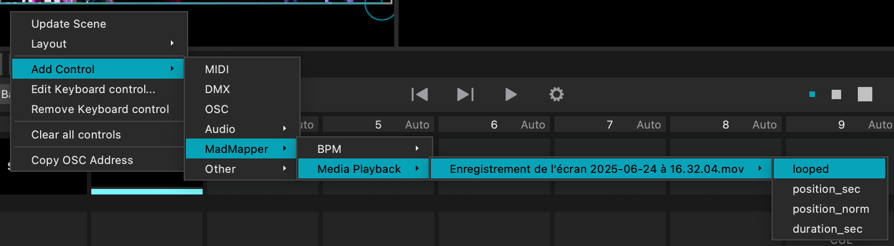
    - d'autres modules additionnels qui proviennent de l'onglet Modules en haut à gauche. On peux notamment utiliser Firmata avec Arduino.
- des évenements Ableton

## Pour aller + loin

La playlist youtube de Madmapper [MADTutorials Basics](https://www.youtube.com/playlist?list=PLe9qr8GslyxLCyNHgilPmRc6UzgzHfQpM)

Le tuto [MadMapper_OSC](https://github.com/LucieMrc/MadMapper_OSC) pour contrôler des paramètres de MadMapper avec des valeurs envoyés en OSC depuis un téléphone.

Le tuto [utilisation du Spatial Scanner](https://github.com/LucieMrc/MadMapper-SpatialScanner-Tuto) pour scanner rapidement des scènes et en sortir une image correspondant à ce que "voit" le projecteur.